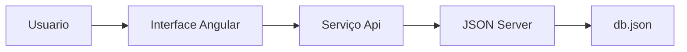
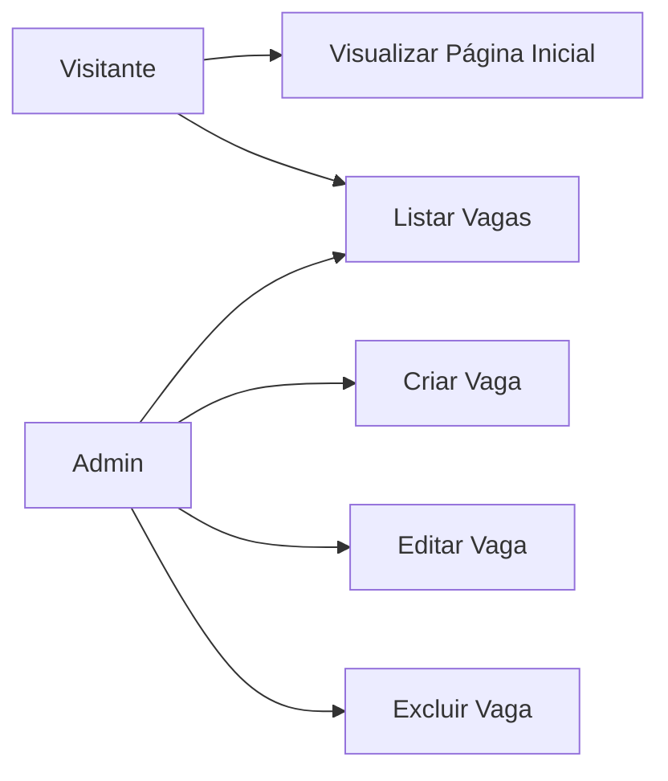
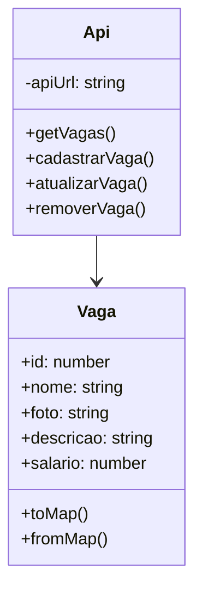

# Documentação de Especificação de Requisitos de Software (SRS)

Documento baseado na ISO/IEEE 29148:2018

# 💼 Plataforma RH - Módulo de Vagas

**Padrão:** ISO/IEC/IEEE 29148:2018
**Versão:** 1.0.0
**Data:** 2026-06-11
**Autor:** LuanBasani

---

# 1. Introdução

## 1.1 Propósito

Este documento descreve o sistema **Plataforma RH - Módulo de Vagas**, com o objetivo de:

* Definir funcionalidades de gerenciamento de vagas
* Padronizar entendimento entre stakeholders
* Servir como base para desenvolvimento e testes

---

## 1.2 Escopo

O sistema permite:

* Visualização de vagas disponíveis
* Gerenciamento administrativo de vagas (criar, editar, excluir)
* Persistência de dados em JSON Server

O sistema foi desenvolvido utilizando:

* Angular 21.2.0
* TypeScript 5.9.2
* RxJS 7.8.0
* JSON Server
* HTML5
* SCSS

---

## 1.3 Definições

| Termo | Definição |
|-------|-----------|
| Vaga | Posição em aberto na empresa com dados: nome, foto, descrição e salário |
| Administrador | Usuário com acesso ao painel de gerenciamento de vagas |
| API | Interface que conecta o frontend ao JSON Server |
| JSON Server | Servidor HTTP simulado baseado em arquivo JSON |

### Acrônimos

* RF — Requisito Funcional
* RNF — Requisito Não Funcional
* LR — Regra de Negócio

---

# 2. Descrição Geral do Sistema

## 2.1 Perspectiva do Sistema



---

## 2.2 Funções do Sistema

O sistema deve:

* Listar vagas disponíveis
* Visualizar página inicial
* Criar novas vagas
* Editar vagas existentes
* Excluir vagas
* Persistir dados no backend

---

## 2.3 Classes de Usuários

| Usuário | Descrição |
|---------|-----------|
| Visitante | Visualiza vagas na página inicial e listagem |
| Administrador | Acessa o painel para criar, editar e excluir vagas |

---

## 2.4 Ambiente Operacional

* Navegador Web moderno (Chrome, Firefox, Safari, Edge)
* Node.js 16+ para executar JSON Server
* Angular CLI 21.2.13
* Sistema Operacional: Windows, macOS ou Linux

---

## 2.5 Restrições

* Sistema executado localmente
* Sem autenticação de usuários
* Sem controle de perfis
* Sem validação avançada de dados
* Sem integração com APIs externas

---

## 2.6 Suposições

* Usuário possui conhecimento básico de informática
* Navegador com JavaScript habilitado
* Acesso ao servidor JSON Server ativo na porta 3010

---

# 3. Requisitos do Sistema

## 3.1 Requisitos Funcionais

### RF-001 — Listar Vagas

**Descrição:** Permitir visualização de todas as vagas disponíveis.

**Critérios de Aceitação:**

* Listar vagas a partir do backend
* Exibir: nome, foto, descrição e salário
* Carregar automaticamente ao abrir página

---

### RF-002 — Gerenciar Vagas - Criar

**Descrição:** Permitir cadastro de novas vagas.

**Critérios de Aceitação:**

* Nome obrigatório
* Foto obrigatória
* Descrição obrigatória
* Salário obrigatório
* Validação de campos vazios
* Feedback ao usuário (alerta)

---

### RF-003 — Gerenciar Vagas - Editar

**Descrição:** Permitir edição de vagas existentes.

**Critérios de Aceitação:**

* Selecionar vaga para editar
* Modificar dados da vaga
* Validação de campos obrigatórios
* Atualizar no backend
* Feedback ao usuário (alerta)

---

### RF-004 — Gerenciar Vagas - Excluir

**Descrição:** Permitir exclusão de vagas.

**Critérios de Aceitação:**

* Selecionar vaga para deletar
* Remover do backend
* Atualizar lista
* Feedback ao usuário (alerta)

---

## 3.2 Requisitos Não Funcionais

### RNF-001 — Responsividade

O sistema deve funcionar adequadamente em diferentes resoluções de tela.

---

### RNF-002 — Desempenho

Tempo de carregamento de vagas inferior a 2 segundos em ambiente local.

---

### RNF-003 — Persistência de Dados

Utilizar JSON Server para armazenar dados em arquivo db.json.

---

### RNF-004 — Framework UI

Utilização do Angular 21.2.0 com TypeScript para estrutura e lógica.

---

### RNF-005 — Organização do Código

Separação adequada entre:

* Componentes (apresentação)
* Serviços (lógica de negócio)
* Modelos (tipos de dados)

---

# 4. Regras de Negócio

| Código | Regra |
|--------|-------|
| LR-001 | Todos os campos de vaga são obrigatórios |
| LR-002 | Salário deve ser um valor numérico |
| LR-003 | Vaga deletada não pode ser recuperada |
| LR-004 | Lista de vagas é atualizada após cada operação |
| LR-005 | API se conecta ao JSON Server na porta 3010 |

---

# 5. Modelos do Sistema

## 5.1 Diagrama de Casos de Uso



---

## 5.2 Diagrama de Classes



---

# 6. Estrutura do Projeto

```txt
sa-rh-completo/
│
├── src/
│   ├── app/
│   │   ├── view/
│   │   │   ├── inicio/
│   │   │   │   ├── inicio.ts
│   │   │   │   ├── inicio.html
│   │   │   │   └── inicio.scss
│   │   │   ├── vagas/
│   │   │   │   ├── vagas.ts
│   │   │   │   ├── vagas.html
│   │   │   │   └── vagas.scss
│   │   │   ├── painel-vagas/
│   │   │   │   ├── painel-vagas.ts
│   │   │   │   ├── painel-vagas.html
│   │   │   │   └── painel-vagas.scss
│   │   │   └── fragmentos/
│   │   │       ├── header/
│   │   │       │   ├── header.ts
│   │   │       │   └── header.html
│   │   │       └── footer/
│   │   │           ├── footer.ts
│   │   │           └── footer.html
│   │   │
│   │   ├── service/
│   │   │   └── api.ts
│   │   │
│   │   ├── model/
│   │   │   └── vaga.model.ts
│   │   │
│   │   ├── app.routes.ts
│   │   └── app.ts
│   │
│   ├── assets/
│   ├── styles/
│   └── index.html
│
├── backend/
│   └── db.json
│
├── angular.json
├── package.json
├── tsconfig.json
├── README.md
└── .gitignore
```

---

# 7. Banco de Dados

O banco está disponível em:

```txt
backend/db.json
```

### Estrutura

```json
{
  "vagas": [
    {
      "id": "1",
      "nome": "Dev front",
      "foto": "foto1.jpg",
      "descricao": "Trampar com visual",
      "salario": "6000"
    },
    {
      "id": "2",
      "nome": "Desenvolver BackEnd Pleno",
      "foto": "https://via.placeholder.com/300x200?text=Backend+Pleno",
      "descricao": "Trabalhar com Desenvolvimento Web",
      "salario": 9000
    }
  ]
}
```

---

# 8. Como Executar

### 8.1 Instalar dependências

```bash
npm install
```

### 8.2 Iniciar JSON Server (terminal 1)

```bash
npx json-server --watch backend/db.json --port 3010
```

### 8.3 Iniciar Angular (terminal 2)

```bash
npm start
```

Ou manualmente:

```bash
ng serve
```

### 8.4 Acessar a Aplicação

```
http://localhost:4200
```

---

# 9. Análise de Risco

| Risco | Impacto | Mitigação |
|-------|---------|-----------|
| Perda de conexão com JSON Server | Alto | Validação de conexão |
| Dados inválidos no formulário | Médio | Validação de campos obrigatórios |
| Inconsistência de dados | Médio | Atualizar lista após operações |
| Corrupção de db.json | Alto | Backup manual do arquivo |

---

# 10. Controle de Versão

| Versão | Data | Autor | Alteração |
|--------|------|-------|-----------|
| 1.0.0 | 2026-06-11 | LuanBasani | Versão inicial com CRUD de vagas |

---

# 11. Funcionalidades Implementadas

* Página inicial com navegação
* Listagem de vagas
* Painel administrativo
* Criar nova vaga
* Editar vaga existente
* Excluir vaga
* Componentes Header e Footer
* Serviço de conexão com API (GET, POST, PUT, DELETE)
* Modelo Vaga com mapeamento de dados
* Roteamento com 3 rotas principais
* Validação de campos obrigatórios
* Feedback visual com alertas ao usuário
* Persistência de dados em JSON Server
* Integração com backend na porta 3010
